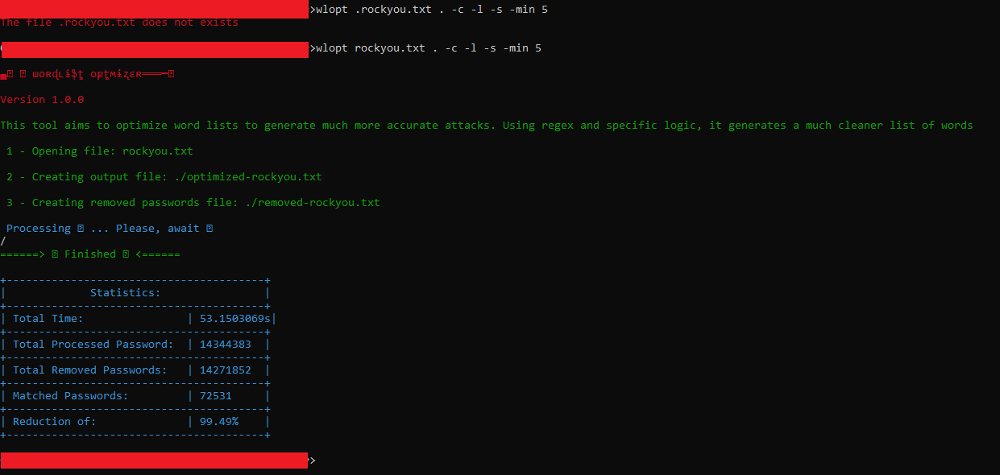

# ▄︻デաօʀɖʟɨֆȶ օքȶʍɨʐɛʀ═══━一

 Version 1.0.0

This tool aims to optimize word lists to generate much more accurate attacks. Using regex and specific logic, it generates a much cleaner list of words.

OBS: Use this at your risk, this is intended for pentesters. I AM NOT RESPONSIBLE FOR ANY DAMAGE CAUSED BY A WRONG USE OF THIS TOOL !!!

## Requirements

- Golang version 1.22.0

## How to install - linux/macOs

1 - clone this repository to a location of your choice. I recommend usr/bin

2 - enter the folder, and run the following command: **chmod +x install-linux.sh**

3 - after the finish,  you can open a new terminal or run  **source ~/.bashrc** or in case of zsh,  **source ~/.zshrc**

## How to install - windows

1  - clone this repository to a location of your choice. I recommend c:\

2  - enter the folder and run **go build -o wlopt.exe main.go**

3  - copy the path of the generated wlopt.exe file

4  - Press Win + Pause/Break to open System Settings.

5  - Click "Advanced System Settings" in the left pane.

6  - In the "System Properties" window, click the "Environment Variables..." button in the "Advanced" tab.

7  - You can set environment variables for the current user or for the system.

8 - In the "User Variables" section, click "**New**" to add a new environment variable for the current user as **wlopt.exe** file path.

9 - In the "System Variables" section, click "**New**" to add a new environment variable for the system as **wlopt.exe** file path.

10 - Add a variable, enter a name and value for it.

11 - Click OK to Confirm

After adding variables, click "OK" to confirm and close the windows.

## How to use

To see how to use the tool, just type wlop in the terminal. If the installation was done correctly you should see instructions on the screen

**Usage 1**: wlopt [word list path] [save result path] [flags]

-**c** to include passwords with uppercase letters

-**l** to include passwords with lowercase letters

-**s** to include passwords with the following special symbols: [!@#$%^&*(),.?\":{}|<>]

-**r** followed by custom regex to filter passwords

-**n** to include passwords with numbers

-**max** followed by an integer to include passwords with maximum length

-**min** followed by an integer to include passwords of minimum length

Example:

wlopt /usr/share/wordlists/rockyou.txt /usr/share/wordlists -c -l -n -min 5 -max 8 -r "test"

The above command filters passwords with:

- capital letter (-c)
- with lowercase letters (-l)
- with numbers (-n)
- with a minimum duration of 5 (-min 5)
- with a maximum length of 8 (-max 8)
- with the word "test" in the text

and saving to /usr/share/wordlists

The optimized file will have the following name **optimized-xxx.txt** where xxx is the name of the input word list file

The file with all passwords that **did not**  meet the filter will be written to **removed-xxx.txt** where xxx is the name of the input word list file

## Popular Patterns Filtering

If you want, you can directly filter some popular password patterns:

**Usage 2**: wlopt [word list path] [save result path] -service

where the service can be:

- aws
- gmail
- hotmail
- tiktok
- wiFi
- ssh
- facebook
- instagram
- alibaba
- yahoo
- ibm
- windows
- linkedIn

Example:

wlopt /usr/share/wordlists/rockyou.txt /usr/share/wordlists -wifi

NOTE: You can select only one service

## Performance

Here we have an test filtering for passwords with capital letters, lowercase letters, special simbols and with min length of 5 caracteres on a wordlist of 14 millions of passwords. As you can see, it took less than an minute :) 

## Follow me :D

=> [Npm](https://www.npmjs.com/~r9n)
=> [Medium](https://medium.com/@ronaldomodesto_84548/chatgpt-and-secure-development-3f062dd4b8c)
=> [Dev.to](https://dev.to/r9n)
=> [GitHub](https://github.com/R9n/portfolio)https://github.com/R9n/portfolio
== [LinkedIn](https://br.linkedin.com/in/ronaldo-mp)
